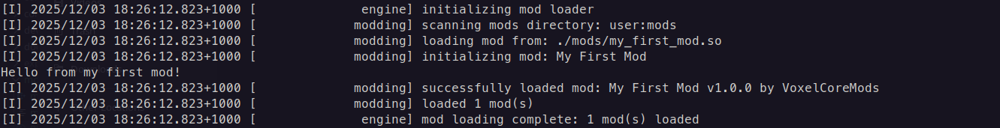

# mod_examples

## How to Build My First Mod?

```bash
mkdir build && cd build
```

```bash
cmake ..
```

```bash
cmake --build .
```

## How to play with compiled '.so' / '.dll' mods?
Put it into '/mods/*' directory in game folder

## Valid Result
